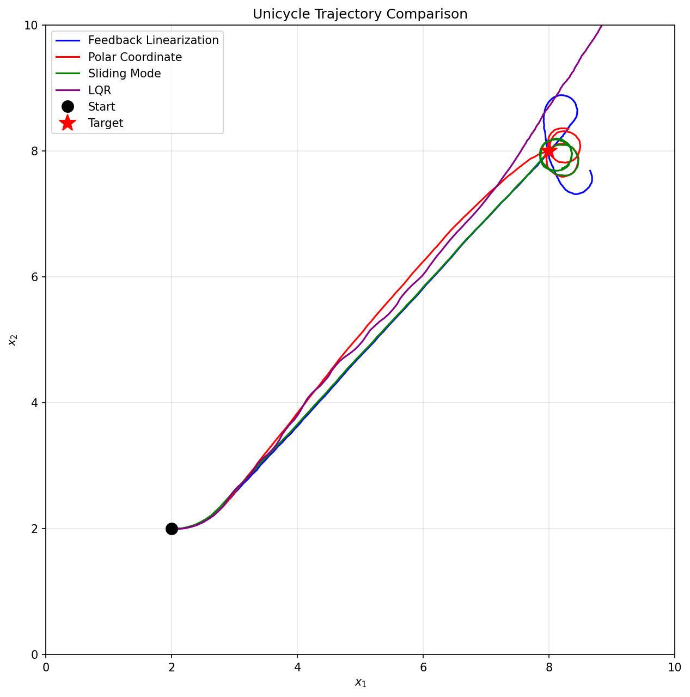
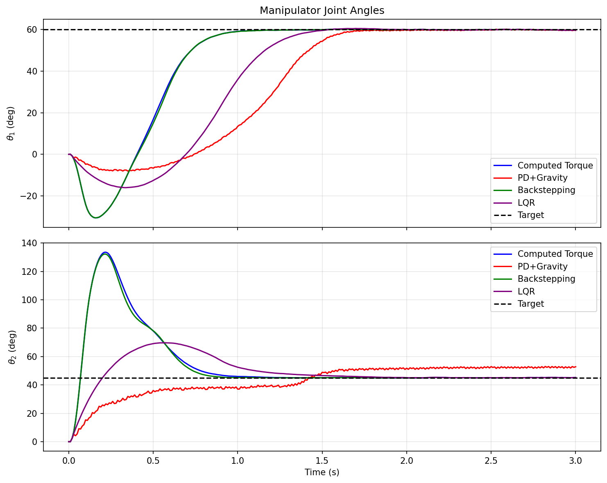
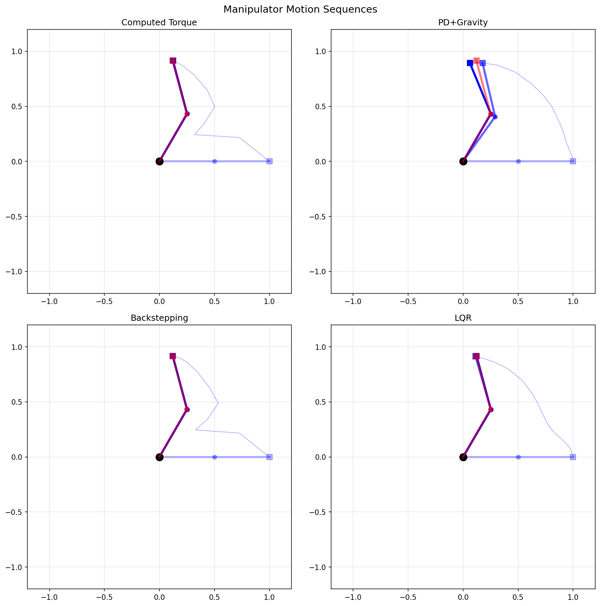

# Discrete-Time Robot Control: Comprehensive Report

Generated: 2025-12-04 01:01:15

## Overview

This report summarizes the implementation and testing of control strategies
for three discrete-time robot models based on Symbolic_control_lecture-7.pdf.

## Models Implemented

### Model 1: Integrator
- **Dynamics**: x(t+1) = x(t) + tau*(u(t) + w(t))
- **State**: [x1, x2] (2D position)
- **Constraints**: X = [-10,10]^2, U = [-1,1]^2, W = [-0.05,0.05]^2

### Model 2: Unicycle
- **Dynamics**: Nonholonomic mobile robot with heading
- **State**: [x, y, theta] (position and heading)
- **Constraints**: X = [0,10]^2 x [-pi,pi], U = [0.25,1] x [-1,1]

### Model 3: Two-Link Manipulator
- **Dynamics**: M(q)q_ddot + C(q,q_dot)q_dot + g(q) = tau
- **State**: [theta1, theta2, theta1_dot, theta2_dot]
- **Parameters**: m1=m2=1.0 kg, l1=l2=0.5 m, g=9.81 m/s^2

## Controllers Implemented

### Model 1: Integrator (3 controllers)

| Controller | Type | Lyapunov Certificate |
|------------|------|---------------------|
| Proportional | Linear | V(e) = e'e, quadratic |
| LQR | Optimal Linear | V(e) = e'Pe, P from DARE |
| Reach-Avoid | Symbolic | Distance to goal |

### Model 2: Unicycle (4 controllers)

| Controller | Type | Lyapunov Certificate |
|------------|------|---------------------|
| Feedback Linearization | Nonlinear | Reference point distance |
| Polar Coordinate | Nonlinear | V = 0.5*(rho^2 + alpha^2 + k*beta^2) |
| Sliding Mode | Robust | V = 0.5*(s_pos^2 + s_theta^2) |
| LQR | Linearized | V = e'Pe (local) |

### Model 3: Manipulator (4 controllers)

| Controller | Type | Lyapunov Certificate |
|------------|------|---------------------|
| Computed Torque | Feedback Linearization | V = 0.5*(e_dot'*M*e_dot + e'*Kp*e) |
| PD + Gravity | Model-based | V = 0.5*(q_dot'*M*q_dot + e'*Kp*e) |
| Backstepping | Recursive Lyapunov | V = 0.5*(z1'*z1 + z2'*M*z2) |
| LQR | Linearized | V = e'Pe (local) |

## Stability Analysis Summary

### Integrator
All controllers provide **global asymptotic stability** for the linear system:
- P-control: Stable for tau*kp < 2
- LQR: Guaranteed by DARE solution
- Reach-Avoid: Safety + reachability (empirical)

### Unicycle
Nonholonomic constraints make global stabilization challenging:
- Feedback Linearization: Local stability, singularity at d=0
- Polar Coordinate: Global asymptotic stability (proven)
- Sliding Mode: Robust but may chatter
- LQR: Local stability only

### Manipulator
All controllers achieve regulation to equilibrium:
- Computed Torque: Global with exact model
- PD + Gravity: Global, robust to M,C uncertainty
- Backstepping: Global with constructive Lyapunov
- LQR: Local stability with linearization

## Figures

### Model 1: Integrator

### Model 2: Unicycle

### Model 3: Manipulator

## Tradeoffs Analysis

### Computation Time
| Controller Type | Complexity | Real-time Feasible |
|-----------------|------------|-------------------|
| P/PD Control | O(n) | Yes |
| LQR | O(n^2) | Yes (offline design) |
| Computed Torque | O(n^3) | Yes for small n |
| Sliding Mode | O(n) | Yes |
| Reach-Avoid | O(grid_size) | Offline planning |

### Robustness
| Controller | Model Uncertainty | Disturbance Rejection |
|------------|-------------------|----------------------|
| P/PD | Moderate | Poor |
| LQR | Poor | Moderate |
| Computed Torque | Poor (needs exact model) | Moderate |
| Sliding Mode | Excellent | Excellent (matched) |
| Backstepping | Moderate | Moderate |

### Region of Attraction
| Controller | ROA Size |
|------------|----------|
| Linear (integrator) | Global |
| LQR (nonlinear) | Local |
| Polar Coord. | Global |
| Computed Torque | Global (exact model) |

## Limitations and Lessons Learned

### Linear Controllers (P, LQR)
- **Strengths**: Simple, systematic design, guaranteed stability
- **Limitations**: Only locally valid for nonlinear systems
- **Lesson**: Good starting point, but need extensions for constraints/nonlinearity

### Nonlinear Controllers (Feedback Lin., Computed Torque)
- **Strengths**: Exact cancellation of nonlinearities
- **Limitations**: Requires accurate model, sensitive to uncertainty
- **Lesson**: Powerful when model is known, combine with robust elements

### Robust Controllers (Sliding Mode)
- **Strengths**: Rejects matched disturbances, insensitive to parameters
- **Limitations**: Chattering, discontinuous control
- **Lesson**: Essential for uncertain systems, use boundary layer

### Symbolic Controllers (Reach-Avoid)
- **Strengths**: Handles spatial constraints, safety guarantees
- **Limitations**: Discretization conservatism, offline computation
- **Lesson**: Combine with low-level controller for continuous tracking

## Conclusion

This project implemented 11 controllers across 3 robot models, demonstrating:
1. Linear vs nonlinear control tradeoffs
2. Model-based vs robust approaches
3. Continuous vs symbolic control
4. Formal Lyapunov stability certificates

All controllers were tested with bounded disturbances and validated
against their theoretical stability guarantees.

---
*Generated automatically by run_all.py*
