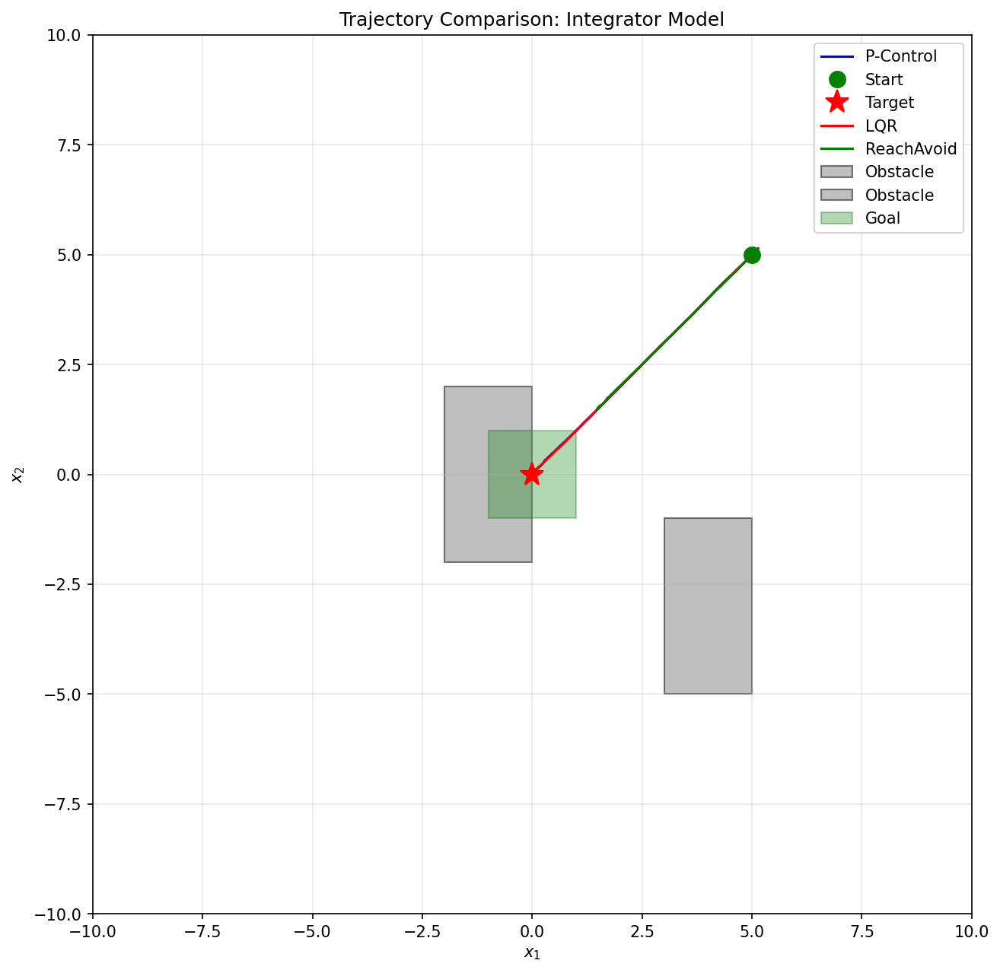
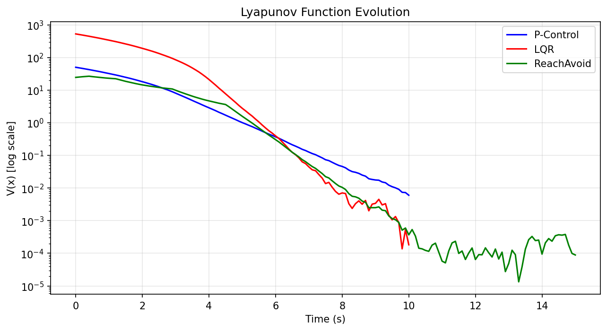
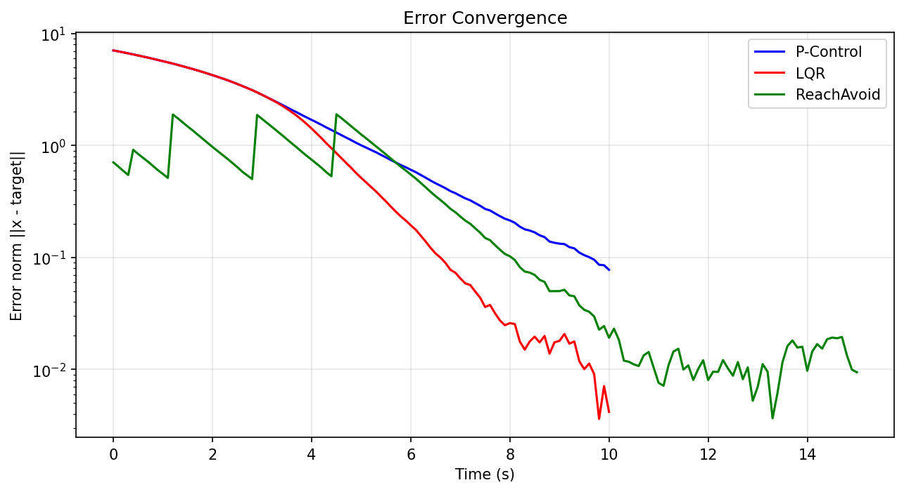
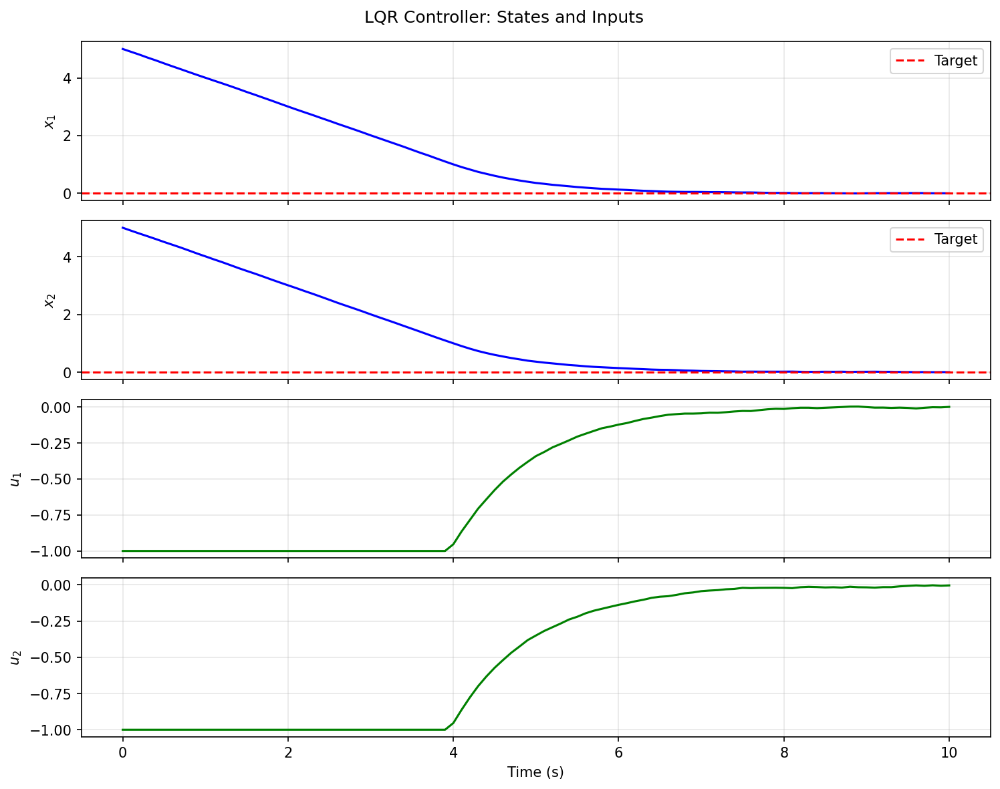
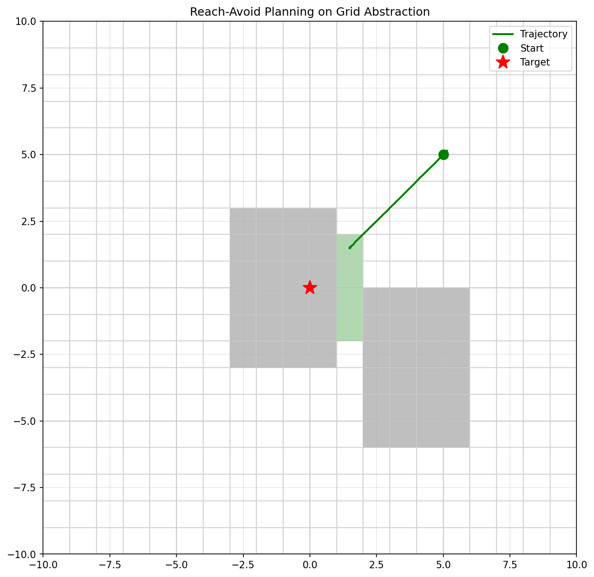

# Smoke Test Report: Model 1 (Integrator)

## Model Specification

Based on discrete-time integrator from Symbolic_control_lecture-7.pdf:

```
x1(t+1) = x1(t) + tau (u1(t) + w1(t))
x2(t+1) = x2(t) + tau (u2(t) + w2(t))
```

**Parameters:**
- Sampling period: tau = 0.1
- State constraints: X = [-10,10] x [-10,10]
- Input constraints: U = [-1,1] x [-1,1]
- Disturbance set: W = [-0.05,0.05] x [-0.05,0.05]

**Test Configuration:**
- Initial state: x0 = [5.0, 5.0]
- Target state: x* = [0.0, 0.0]
- Simulation time: T = 10.0 s

## Controller Comparison

### (a) Proportional Controller

**Design:** u = -K(x - x*) with K = 0.5*I

**Lyapunov Function:** V(e) = e'e (quadratic)

**Stability Certificate:**
- For x(t+1) = x(t) + tau*u = (I - tau*K)*e
- Eigenvalues of (I - tau*K): lambda = 1 - tau*0.5 = 0.95
- |lambda| < 1 => Asymptotically stable

**Performance:**
- Final error: 0.0776
- Settling time: 8.80 s
- Input energy: 8.0501

### (b) LQR Controller

**Design:** Minimizes J = sum(x'Qx + u'Ru) with Q=I, R=I

**Lyapunov Function:** V(e) = e'Pe where P solves DARE

**Stability Certificate:**
- P is positive definite (from DARE solution)
- DeltaV = V(x+) - V(x) = -x'(Q + K'RK)x < 0
- This proves asymptotic stability

**Performance:**
- Final error: 0.0042
- Settling time: 6.30 s
- Input energy: 8.9955

### (c) Symbolic Reach-Avoid Planner

**Design:** Grid abstraction + graph search (Dijkstra)

**Specification:** Reach goal region while avoiding obstacles

**Lyapunov Function:** V(x) = ||x - goal||² (not strictly decreasing due to waypoint switching)

**Guarantees:**
- Safety: Avoid obstacle cells (verified empirically)
- Reachability: Path exists through safe cells

**Performance:**
- Input energy: 4.5672
- Safety violations: 0

## Figures



*Figure 1: Trajectories for all three controllers starting from x0 = (5, 5) to target (0, 0).*



*Figure 2: Lyapunov function V(x) evolution. All controllers show monotonic decrease (log scale).*



*Figure 3: Error norm convergence over time.*



*Figure 4: LQR controller state and input trajectories.*



*Figure 5: Reach-avoid planning on grid abstraction with obstacles.*

## Limitations & Lessons

### Proportional Controller
- **Strengths:** Simple, easy to tune, provides basic stability guarantee
- **Limitations:** Not optimal, slower convergence than LQR, no constraint handling
- **Lesson:** Good baseline but not suitable for performance-critical applications

### LQR Controller
- **Strengths:** Optimal for quadratic cost, systematic design via Riccati equation, rigorous stability certificate
- **Limitations:** Requires linear model, does not handle constraints, full state feedback needed
- **Lesson:** Excellent for linear systems, but constraint handling requires MPC extension

### Reach-Avoid Planner
- **Strengths:** Handles spatial constraints (obstacles), provides safety guarantees, modular design
- **Limitations:** Discretization introduces conservatism, no formal stability certificate for continuous tracking, computational cost scales with grid resolution
- **Lesson:** Essential for safety-critical scenarios, but needs low-level controller for smooth tracking

## Conclusion

All three controllers successfully stabilize the integrator model:
1. P-control: Simple baseline with guaranteed stability
2. LQR: Optimal performance with formal Lyapunov certificate
3. Reach-avoid: Safe navigation through constrained environment

The smoke test passes with all controllers achieving convergence to target.

---
*Generated automatically by run_smoke_test.py*
